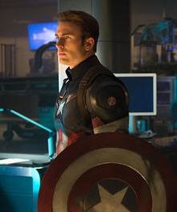

# Iron man (Tony Stark)
Iron Man is een superheld die bekend staat om zijn hightech harnas. Hij is eigenlijk Tony Stark, een rijke en slimme man die zijn eigen wapenbedrijf leidt. Nadat hij gewond raakte tijdens een ontvoering, bouwde hij een krachtig harnas om te overleven en ontsnapte hij. Nu gebruikt hij zijn harnas om te vliegen, vechten en misdaden te bestrijden. Hij heeft vele wapens en gereedschappen in zijn harnas en is ook erg slim en charismatisch.
 
 
 
 

# Personages

 
Tony Starks voormalige assistent en vriend, Virginia "Pepper" Potts, vertelt over haar ervaringen met Iron Man in verschillende films, waaronder "Iron Man" (2008) en "Iron Man 3" (2013). Ze is vaak betrokken bij de avonturen van Tony en Iron Man en speelt een belangrijke rol bij het redden van de wereld.

James Rhodes, ook bekend als War Machine, is een goede vriend van Tony Stark en heeft verschillende keren met hem samengewerkt in de strijd tegen het kwaad. Hij vertelt over zijn ervaringen met Iron Man in de films "Iron Man 2" (2010), "Iron Man 3" (2013), en "Avengers: Age of Ultron" (2015).
 
 

Natasha Romanoff, ook bekend als Black Widow, werkte samen met Iron Man in de film "Iron Man 2" en "Avengers" (2012). Ze beschrijft Tony als een arrogante en grappige man die, ondanks zijn fouten, altijd de juiste beslissing neemt wanneer het er echt toe doet.
 
 

Steve Rogers, ook bekend als Captain America, heeft samengewerkt met Iron Man in verschillende films, waaronder "The Avengers" (2012), "Captain America: Civil War" (2016), en "Avengers: Infinity War" (2018). Hij en Tony hebben vaak verschillende ideeën over wat de juiste aanpak is, maar ze hebben ook veel respect voor elkaar en delen een gemeenschappelijke missie om de wereld te beschermen.
 
 
 
 

# Comics

Iron Man: Extremis (January 2005 – April 2006)
 
 

The Invincible Iron Man (October 07, 2015)
 
 
Iron Man: Demon in a Bottle (March – November 1979)
 
 
